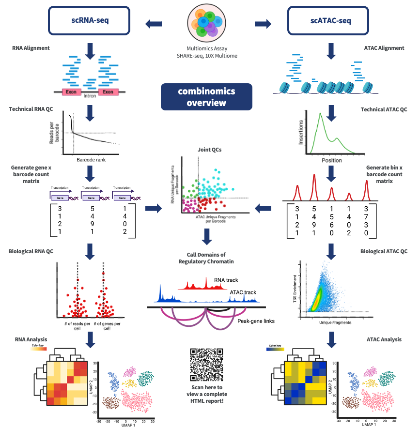

# Broad Institute of MIT and Harvard Single-Cell/Nucleus Multiomic Processing Pipeline

Pipeline specifications can be found [here](https://docs.google.com/document/d/1J-NWpDLkEGLsLjVe6h6-Rx4nxzTdgy1TJZvuMnYiiyg/edit?usp=sharing).

Pipeline main page on [dockstore](https://dockstore.org/workflows/github.com/broadinstitute/epi-SHARE-seq-pipeline/SHARE-seq:release?tab=info).

<p align="center">
  
</p>

### Structure of this repo
* The **tasks** directory contains the tasks called from the main workflow share-seq.wdl. Each task corresponds to a different step of the pipeline: *align*, *filter*, etc.
* The **src** directory contains bash, Python, R, and notebook scripts called within the tasks.
* The **dockerfiles** directory contains the Dockerfiles used to build the Docker images used by the pipeline.

## Introduction

The **SHARE-seq** multiomic pipeline is based off the original Buenrostro SHARE-seq pipeline specifications (by Sai Ma) in [this github repo](https://github.com/masai1116/SHARE-seq-alignment).

This **10X** single-cell multiomic pipeline is based off the ENCODE (phase 3) single-cell pipeline specifications (by Anshul Kundaje) in [this google doc](https://docs.google.com/document/u/2/d/e/2PACX-1vTlgtT4WeXbvRicybUHXnhZs8RKyB4EkTbcWooQ6qBxxQ_zIHpFEVHy38D5lC_s8_YDGfUTsyomJcs3/pub).

### Features

* **Portability**: The pipeline can be run on different cloud platforms such as Google, AWS and DNAnexus, as well as on cluster engines such as SLURM, SGE and PBS.
* **User-friendly HTML report**: In addition to the standard outputs, the pipeline generates an HTML report that consists of quality metrics including alignment statistics along with many useful plots. An example of the [HTML report](). # TODO: add an example html.
* **Supported genomes**: The pipeline requires genome-specific data such as aligner indices, chromosome sizes, and blacklisted regions. We provide genome references for hg38, mm10, mm39.

## Installation

1) Install Caper (Python Wrapper/CLI for [Cromwell](https://github.com/broadinstitute/cromwell)).
	```bash
	$ pip install caper
	```

2) **IMPORTANT**: Read Caper's [README](https://github.com/ENCODE-DCC/caper/blob/master/README.md) carefully to choose a backend for your system. Follow the instructions in the configuration file.
	```bash
	# backend: local or your HPC type (e.g. slurm, sge, pbs, lsf). read Caper's README carefully.
	$ caper init [YOUR_BACKEND]

	# IMPORTANT: edit the conf file and follow commented instructions in there
	$ vi ~/.caper/default.conf
	```

3) Git clone this pipeline.
	```bash
	$ cd
	$ git clone https://github.com/broadinstitute/epi-SHARE-seq-pipeline/ #TODO: This should point to the release
	```

4) Define test input JSON.
	```bash
	INPUT_JSON="" #TODO: We need a test dataset available for everyone
	```

5) If you have Docker and want to run the pipeline locally on your laptop, `--max-concurrent-tasks 1` limits the number of concurrent tasks to test-run on a laptop. Uncomment if running on a workstation/HPC.
	```bash
	# check if Docker works on your machine
	$ docker run ubuntu:latest echo hello

	# --max-concurrent-tasks 1 is for computers with limited resources
	$ caper run share-seq.wdl -i "${INPUT_JSON}" --docker --max-concurrent-tasks 1
	```

6) Otherwise, install Singularity on your system. Please follow [these instructions](https://neuro.debian.net/install_pkg.html?p=singularity-container) to install Singularity on a Debian-based OS. Or ask your system administrator to install Singularity on your HPC.
	```bash
	# check if Singularity works on your machine
	$ singularity exec docker://ubuntu:latest echo hello

	# on your local machine (--max-concurrent-tasks 1 is for computers with limited resources)
	$ caper run share-seq.wdl -i "${INPUT_JSON}" --singularity --max-concurrent-tasks 1

	# on HPC, make sure that Caper's conf ~/.caper/default.conf is correctly configured to work with your HPC
    # the following command will submit Caper as a leader job to SLURM with Singularity
    $ caper hpc submit share-seq.wdl -i "${INPUT_JSON}" --singularity --leader-job-name ANY_GOOD_LEADER_JOB_NAME

    # check job ID and status of your leader jobs
    $ caper hpc list

    # cancel the leader node to close all of its children jobs
    # If you directly use cluster command like scancel or qdel then
    # child jobs will not be terminated
    $ caper hpc abort [JOB_ID]
	```

## Input JSON file

> **IMPORTANT**: DO NOT BLINDLY USE A TEMPLATE/EXAMPLE INPUT JSON. READ THROUGH THE FOLLOWING GUIDE TO MAKE A CORRECT INPUT JSON FILE.

An input JSON file specifies all of the input parameters and files that are necessary for successfully running this pipeline. This includes a specification of the path to the genome reference files and the raw data FASTQ files. Please make sure to specify absolute paths rather than relative paths in your input JSON files.

1) [Input JSON file specification (short)](docs/input_short.md)
2) [Input JSON file specification (long)](docs/input.md)


## Running on Terra/Anvil (using Dockstore)

Visit our pipeline repo on [Dockstore](https://dockstore.org/my-workflows/github.com/broadinstitute/epi-SHARE-seq-pipeline/SHARE-seq). Click on `Terra` or `Anvil`. Follow Terra's instructions to create a workspace on Terra and add Terra's billing bot to your Google Cloud account.

Download this [test input JSON for Terra](we don't have one at the moment), upload it to Terra's UI, and then run the analysis.

If you would like to use your own input JSON file, make sure that all files in the input JSON are on a Google Cloud Storage bucket (`gs://`). URLs will not work.

## How to organize outputs

Install [Croo](https://github.com/ENCODE-DCC/croo#installation). Make sure that you have python3(> 3.4.1) installed on your system. Find a `metadata.json` on Caper's output directory.

```bash
$ pip install croo
$ croo [METADATA_JSON_FILE]
```

## How to make a spreadsheet of QC metrics

Install [qc2tsv](https://github.com/ENCODE-DCC/qc2tsv#installation). Make sure that you have Python 3 (>3.4.1) installed on your system. 

Once you have [organized the output with Croo](#how-to-organize-outputs), you will be able to find the pipeline's final output file `qc/qc.json` which contains all the QC metrics. Simply feed `qc2tsv` with multiple `qc.json` files. It can take various URIs such as local paths, `gs://`, and `s3://`.

```bash
$ pip install qc2tsv
$ qc2tsv /sample1/qc.json gs://sample2/qc.json s3://sample3/qc.json ... > spreadsheet.tsv
```

QC metrics for each experiment (`qc.json`) will be split into multiple rows (1 for overall experiment + 1 for each bio replicate) in a spreadsheet.

<br>
TODO:\
Sambamba\
no-align\
fix seurat and archr workflows\
add track generation \
only one genome tsv

Thank you to the **ENCODE DAC** for writing excellent documentation for their pipelines that we used as templates.
